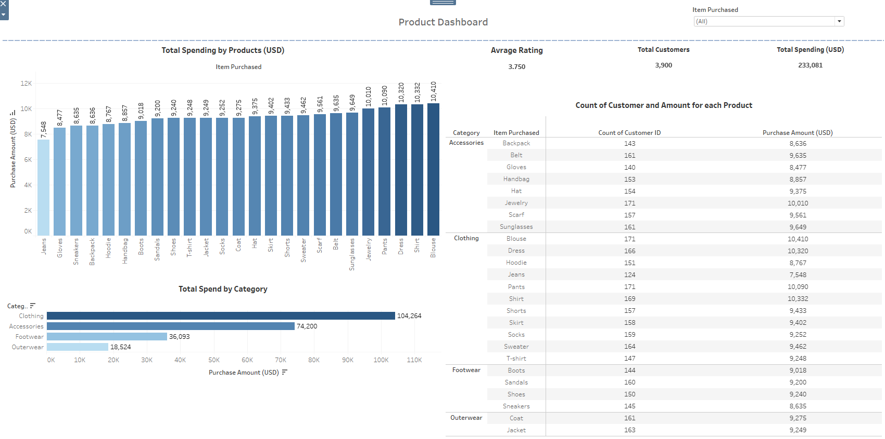

# Tableau Data Analysis

## Description
This project involves data analysis using Tableau. It includes various data visualization techniques and insights derived from the data. The project aims to provide actionable insights through interactive dashboards and custom visualizations.

## Features
- Interactive dashboards for real-time data exploration
- Custom visualizations tailored for specific business insights
- Trend analysis and forecasting capabilities
- Data filtering and segmentation options
- Support for analyzing athlete performance and sales data

## Prerequisites
- Tableau Desktop 2021.4 or later
- Basic understanding of data analysis concepts
- Access to the dataset (described below)

## Installation
To get started with this project, follow these steps:
1. Clone the repository to your local machine.
   ```bash
   git clone https://github.com/tahsinsoyak/tableau-data-analysis.git
   ```
2. Open the project in Tableau.

## Usage
1. Open Tableau and load the data files provided in the project.
2. Explore the different dashboards and visualizations, such as:
   - Athlete performance analysis
   - Sales trends and customer segmentation
3. Modify the visualizations as needed to gain further insights.

## Data Sources
The analysis uses the following data sources:
- **collegiate_athlete_injury_dataset.csv** - Contains athlete performance and injury data
- **sales_data.csv** - Includes sales and customer data for trend analysis

## Project Structure
```
tableau-data-analysis/
├── test_data/                # Raw and processed data files
├── test_analysis/            # Tableau workbook files (.twb or .twbx)
├── screenshots/              # Images of key visualizations
```

## Screenshots

*Product Dashboard*

*Sales Dashboard*

*Athlete Dashboard*

*House Price Dashboard*

## Contributing
Contributions are welcome! Please feel free to submit a Pull Request.

## Contact
For questions or feedback, please contact [tahsinsoyakk@gmail.com]
